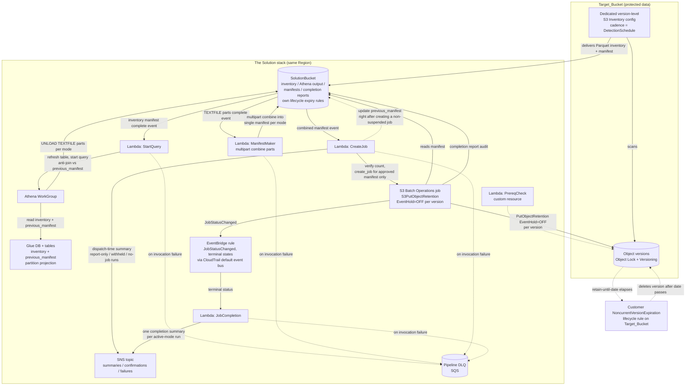

# Architecture

How the pipeline for [Automatic event hold release for Amazon S3 Object Lock](README.md) is wired together, stage by stage, and the design decisions behind it.

## Table of contents

- [Pipeline diagram](#pipeline-diagram)
- [Stage by stage](#stage-by-stage)
- [Failure handling](#failure-handling)
- [Release mechanism](#release-mechanism)
- [Buckets with a mix of Compliance and Governance mode objects](#buckets-with-a-mix-of-compliance-and-governance-mode-objects)
- [Idempotency](#idempotency)
- [Why a batch pipeline instead of a real-time, event-driven Lambda](#why-a-batch-pipeline-instead-of-a-real-time-event-driven-lambda)

## Pipeline diagram

## Stage by stage

Each stage hands off to the next by writing a small JSON *sentinel* file (e.g. `_query_complete.json`, `_manifests_ready.json`) to the SolutionBucket. An S3 event notification on that sentinel's key pattern is what invokes the next Lambda — so a sentinel is only ever written after its stage fully succeeds, and never on failure.

1. **S3 Inventory** — a dedicated version-level Parquet inventory runs at the configured cadence (daily or weekly) and delivers a manifest to the SolutionBucket. Every version-level inventory carries `Bucket`, `Key`, `VersionId`, `IsLatest`, and `IsDeleteMarker` inherently; the stack additionally requests the optional fields `Size`, `LastModifiedDate`, `ObjectLockMode`, `ObjectLockRetainUntilDate`, `ObjectLockLegalHoldStatus`, and `ObjectLockEventHoldStatus`. The first inventory can take up to 48 hours to appear.

The stack requests only fields a query reads, plus long-established Object Lock fields that cost nothing to carry. It deliberately does not request the event-hold *duration* fields: no query projects a duration, so they would add no value, while every requested field is one more enum value that must be valid — an invalid entry fails the inventory configuration and rolls the stack back. If an inventory delivery carries duration columns anyway, they are reported in the schema check's `undeclared_columns` log entry described below.
2. **StartQuery Lambda** — triggered by inventory delivery. First verifies the delivery's own `manifest.json` `fileSchema` actually carries every column the eligibility query reads, and fails the run if not (see [Inventory schema verification](#inventory-schema-verification)). Then runs one authoritative `COUNT(*)` query per `ObjectLockMode`, and launches `UNLOAD` only for non-empty modes. Every eligibility query anti-joins against `previous_manifest` (see [Idempotency](#idempotency)) so it never re-selects a version another run already released or is releasing. In `delete`/`overwrite` modes it also runs one diagnostic query, covering both lock modes, listing exactly the candidates withheld because their superseder classification is ambiguous (see [Classifying versions](CLASSIFYING-VERSIONS.md)); `either` mode never withholds anything and skips the diagnostic.
3. **ManifestMaker Lambda** — triggered when the count and `UNLOAD` queries finish successfully. Concatenates the TEXTFILE parts for each non-empty mode into a single headerless CSV manifest using S3 multipart `UploadPartCopy`, and combines the withheld-candidates diagnostic parts (if any) into `diagnostics/withheld-candidates/`.
4. **CreateJob Lambda** — triggered by combined-manifest delivery. Independently verifies each count query's workgroup, state, SQL hash, and result, then creates one S3 Batch Operations job per approved mode — non-suspended in active mode, suspended in report-only mode (see [Report-only and active modes](OPERATIONS.md#report-only-and-active-modes)). A count above `SafetyThreshold` in active mode is withheld without creating a job (see [Safety threshold](OPERATIONS.md#safety-threshold)). Immediately after creating a non-suspended job, it updates `previous_manifest` for that mode. `_job_summary.json` records the latest decision, while `_job_summaries/<decision-id>.json` preserves every decision for the run, including a withheld decision followed by approval.
5. **S3 Batch Operations job (`S3PutObjectRetention`)** — one job per approved mode per run. BOPS reads the mode's manifest and issues `PutObjectRetention` with `EventHold=OFF` once per row, handling concurrency, redriving `TemporaryFailure` results, and writing the completion report CSV to the SolutionBucket as the durable audit record.
6. **JobCompletion Lambda** — triggered by EventBridge when an active-mode run's BOPS job reaches a terminal state (`Complete`/`Cancelled`/`Failed`). Correlates the job back to its run via the job's own tags, reads final per-job `ProgressSummary` counts via `DescribeJob`, and — once every active job the run created is terminal — sends the run's one completion email and writes `_job_summary.json`. Report-only, withheld, and no-job runs skip this entirely; CreateJob already sent their (final, non-changing) email at dispatch time. See [Release mechanism](#release-mechanism) for why this two-path split exists.
7. **Lifecycle cleanup** — after the retain-until-date elapses, a customer-owned `NoncurrentVersionExpiration` lifecycle rule deletes the version (see [Lifecycle integration](OPERATIONS.md#lifecycle-integration)).

**PrereqCheck runs once, at deploy time — not on every pipeline run.** As a CloudFormation custom resource, it validates Object Lock and Versioning on the Target_Bucket during stack create/update and is not part of the recurring StartQuery → ManifestMaker → CreateJob → S3 Batch Operations flow.

## Inventory schema verification

Before it runs any query, StartQuery reads the `fileSchema` from the same `manifest.json` whose delivery triggered it, and checks that the delivery genuinely contains every column the eligibility query reads: `key`, `version_id`, `is_latest`, `is_delete_marker`, `last_modified_date`, `object_lock_mode`, and `object_lock_event_hold_status`. If any is absent, the run fails and lands in the DLQ.

This check exists because the alternative is a silent one. Athena resolves Parquet columns by name and returns NULL for a Glue-declared column the data file does not contain — it does not raise. A column the Glue table declares but the inventory does not deliver therefore makes `object_lock_event_hold_status = 'ON'` match nothing, and the run reports zero eligible versions and succeeds. Nothing distinguishes that from a genuinely healthy run with nothing to do, so without this check a schema mismatch could suppress every release indefinitely without surfacing an error, a DLQ message, or an alarm. It is the only failure in the pipeline that would otherwise be invisible.

The check covers only the columns the query actually reads. `size`, `object_lock_retain_until_date`, and `object_lock_legal_hold_status` are declared on the Glue table for completeness but never projected by any query, so their absence cannot change a result — it is logged, not raised. The reverse case is also logged rather than raised: a column an inventory delivers that the Glue table does not declare is invisible to Athena, and is reported as an `undeclared_columns` entry. A non-Parquet delivery, a malformed `manifest.json`, or a `fileSchema` no column names can be parsed from all fail the run for the same reason: an eligibility result that cannot be trusted is worse than no result.

Every run logs the outcome as an `inventory_schema_checked` entry listing the delivered columns, anything missing, and anything delivered that the Glue table does not declare (and which Athena therefore cannot see).

## Failure handling

StartQuery, ManifestMaker, and CreateJob are invoked asynchronously by S3 event notifications; each has a Lambda `DeadLetterConfig` pointing at the shared pipeline DLQ. JobCompletion is invoked asynchronously by EventBridge and also has a `DeadLetterConfig`.

StartQuery treats a failed inventory schema check, and any Athena failure, cancellation, or timeout, as an invocation failure and does not write `_query_complete.json`, preventing a partial or failed query set from appearing as a successful zero-row run — and preventing ManifestMaker from being triggered at all.

CreateJob treats missing, stale, or mismatched count evidence — or a failed `create_job` call — as a withheld mode and records the reason in SNS and `_job_summary.json` immediately (dispatch time); for an active-mode run, `_job_summary.json`/SNS instead come from JobCompletion once the job(s) finish.

Per-row release outcomes (including any `PermanentFailure`) surface in the BOPS completion report under `reports/<run-id>/<mode>/`, and are also summarized (aggregate succeeded/failed counts) in JobCompletion's email.

## Release mechanism

The solution releases each event hold with a `PutObjectRetention` call setting `EventHold=OFF`. These calls are issued by an **S3 Batch Operations `S3PutObjectRetention` job**. CreateJob creates one job per approved mode per run, with the mode's eligibility manifest (`Bucket,Key,VersionId` CSV) as the job's manifest. S3 Batch Operations owns manifest iteration, concurrency, retries, and the completion report.

- **Scale.** Because S3 Batch Operations owns manifest iteration, per-run scale is effectively unbounded — there is no Lambda aggregate timeout to budget against. `SafetyThreshold` caps how many releases one run attempts, independent of this.
- **What to inspect.** There is a real S3 Batch Operations job in the console. An active-mode job's outcome, including any per-row failures, is in its completion report CSV under `reports/<run-id>/<mode>/` in the SolutionBucket. A report-only run's job never executes, so there is no completion report — see [Report-only and active modes](OPERATIONS.md#report-only-and-active-modes).
- **Cost.** The per-job and per-object-processed Batch Operations charge, plus the per-`PutObjectRetention`-call S3 PUT request charge — see [COST.md](COST.md).

**When the SNS summary email arrives.** For a report-only run, or any run where every mode was withheld or had nothing eligible, the outcome is already final at dispatch time, so the email goes out immediately. For an active-mode run that creates at least one job, CreateJob does **not** send an email itself — `create_job` is asynchronous, so the real per-object outcome (how many actually released, whether any failed) isn't known until the job finishes, which can take anywhere from seconds to a long time depending on manifest size. Instead, the JobCompletion Lambda — triggered by EventBridge on the job's `JobStatusChanged` event (delivered via CloudTrail's always-on management-event stream; no CloudTrail trail is created by this stack) — sends exactly **one** email per run once every active job that run created has reached a terminal state, with real succeeded/failed counts. An active run therefore produces one notification, not a dispatch notification followed by a separate completion one. Both senders build their subject line and body the same way — see [Notification emails](OPERATIONS.md#notification-emails).

## Buckets with a mix of Compliance and Governance mode objects

Retention mode (`Compliance` or `Governance`) is set per object version, not per bucket — a single Target_Bucket can hold versions under both modes at once, and the pipeline handles this without extra configuration. Every stage runs independently per `ObjectLockMode`:

- The eligibility query produces separate results for `COMPLIANCE` and `GOVERNANCE` versions.
- ManifestMaker writes a separate combined manifest per mode (a mode with no eligible versions gets no manifest).
- CreateJob creates a separate S3 Batch Operations job per mode, and each job's `PutObjectRetention` calls use a matching `Mode` — a Compliance-mode job only ever touches Compliance-mode versions, and likewise for Governance.

Every release call sets `BypassGovernanceRetention=false`. As covered in [PERMISSIONS.md](PERMISSIONS.md#governance-bypass--not-required), releasing an event hold never requires a bypass, so no elevated permission is needed to process Governance-mode versions.

## Idempotency

Once a release has actually completed and the target's event hold shows `EventHold=OFF` in a later inventory delivery, that version is excluded from every subsequent eligibility query — regardless of how many times the pipeline reruns.

That guarantee alone does not prevent a second Batch Operations job from being created for versions whose release is still *in flight*, or for a manifest that predates a release that happened elsewhere. Two situations can produce this:

- **`DetectionSchedule=DAILY` inventory delivery lag.** S3 Inventory delivery can take up to ~48 hours even for non-first deliveries, which exceeds the 24-hour `DAILY` interval. A later inventory scan can be taken before an earlier run's Batch Operations job has finished — so the later run's eligibility query, working from a scan that predates the still-in-progress release, would otherwise re-select the same versions.
- **A withheld run's stale manifest.** If a run is withheld under [Safety threshold](OPERATIONS.md#safety-threshold) and later approved by raising `SafetyThreshold`, the versions it originally identified may by then have already been released by an unrelated, more recent run.

**Previous-manifest dedup.** To cover both cases, every eligibility query anti-joins against `previous_manifest`, a small Glue table pointing at the manifest most recently submitted for a **non-suspended (`ConfirmationRequired=false`)** job, per `ObjectLockMode`. CreateJob updates that pointer immediately after creating a non-suspended job — never for a suspended (`ReportOnly=true`) or withheld mode, since neither creates a job that runs. This record is optimistic: it happens right after `create_job` returns, before the asynchronous job has executed, so it does not distinguish "released" from "job created but a row later failed." A row whose release fails still shows `EventHold=ON` in the next inventory delivery and remains a normal candidate; it is suppressed by the dedup anti-join for at most the one subsequent run where the pointer hasn't advanced past it, then re-qualifies once a later non-suspended job for that mode is created. In the meantime, its failure is visible in the BOPS completion report (`reports/<run-id>/<mode>/`, always written with `ReportScope=AllTasks`) for manual follow-up. `PutObjectRetention` itself is also idempotent and never shortens protection, so a duplicate release attempt in this window is billable but not unsafe.

Dedup addresses re-selecting a version the pipeline itself already acted on. It does not make the manifest fresh: no stage re-verifies per-version state at release time, so a release can act on inventory evidence up to ~48 hours old — see [Inventory freshness and the release decision](OPERATIONS.md#inventory-freshness-and-the-release-decision) for what that does and does not permit.

**Retried event notifications never create duplicate work.** S3 event delivery is at-least-once, so the same "manifest delivered" event can invoke the StartQuery or CreateJob Lambda more than once for the same run. StartQuery calls `athena:StartQueryExecution` with a `ClientRequestToken` computed deterministically from the run's identity (bucket, inventory timestamp, and Object Lock mode), so a retried invocation reuses the same Athena query instead of starting a new one. CreateJob calls `s3control:CreateJob` with the same kind of deterministic `ClientRequestToken` (bucket, run ID, inventory timestamp, mode), so a retried CreateJob invocation reuses the same Batch Operations job instead of creating a duplicate.

## Why a batch pipeline instead of a real-time, event-driven Lambda

An event-driven Lambda reacting to individual S3 events (per upload or delete) may look simpler, but it doesn't fit this problem well:

- **No direct "became noncurrent" event.** S3 doesn't emit an event when a version transitions from current to noncurrent. The closest signals (`ObjectCreated:*`, `ObjectRemoved:DeleteMarkerCreated`) describe the *new* current version, not the version it superseded — a synchronous lookup per event would be needed to find and evaluate the superseded version.
- **Existing noncurrent versions need a backlog sweep regardless.** A live trigger only sees events after it's deployed; every version already noncurrent at deploy time needs a full inventory sweep to be evaluated at all. An event-driven approach wouldn't remove the need for a batch sweep, only add a second mechanism alongside it.
- **SafetyThreshold needs a countable checkpoint.** The safety threshold works because eligibility is evaluated as a discrete run with a countable result *before* any release happens, so an unexpected spike (e.g. a mass delete) can be caught and held for confirmation. A stream of per-object events has no equivalent checkpoint to pause at.
- **Cost and ordering at scale.** A Lambda invocation per write does not scale as cheaply as a single Athena scan over a Parquet inventory on high-churn, high-version-count buckets. S3 event notifications are also at-least-once and unordered, which complicates classifying a version as delete- or overwrite-superseded — something an ordered version list from a full inventory report handles cleanly.

The tradeoff is latency — up to the `DetectionSchedule` cadence plus inventory delivery lag of 24–48 hours — in exchange for covering the existing backlog, a clean safety-threshold checkpoint, and cheaper bulk processing. That's appropriate here since nothing time-sensitive depends on a hold being released quickly.
