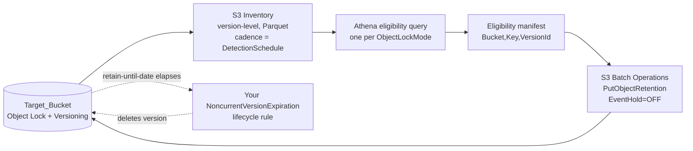

# Automatic event hold release for Amazon S3 Object Lock

> **Disclaimer:** Code is provided as-is, to demonstrate a concept or workflow to AWS customers. You should ensure it meets your requirements, and carefully review the eligibility manifests before running them against non-test data.

Automatically releases the S3 Object Lock **event hold** on noncurrent object versions so the post-event retention countdown begins and a `NoncurrentVersionExpiration` lifecycle rule can eventually delete them.

Deeper detail lives alongside this file: [architecture](ARCHITECTURE.md) · [version classification](CLASSIFYING-VERSIONS.md) · [operations](OPERATIONS.md) · [cost](COST.md) · [permissions](PERMISSIONS.md) · [multi-account and multi-Region deployment](MULTI-ACCOUNT-DEPLOYMENT.md)

## Overview

This solution builds on **Amazon S3 Object Lock Variable Retention with Event Holds** (see [S3 Object Lock](https://docs.aws.amazon.com/AmazonS3/latest/userguide/object-lock.html) in the *Amazon S3 User Guide*). An event hold is an indefinite object lock with a configured `EventHoldDuration`: while the hold is active the object is WORM-protected and its retain-until-date is dynamic, so every `GetObjectRetention` call returns at least `now + EventHoldDuration`.

Versions that have been superseded (deleted or overwritten) typically do not need indefinite protection. This solution automates releasing the hold once a version becomes noncurrent. You choose which class of superseded versions qualifies via the [release mode](#release-modes).

**What releasing a hold does.** Releasing is a non-destructive `PutObjectRetention` call with `EventHold=OFF`. It stops the retain-until-date from being recomputed dynamically and fixes it at:

```
retain-until-date = MAX(existing retain-until-date, release time + EventHoldDuration)
```

Three consequences follow from that formula: protection is never shortened, the full `EventHoldDuration` is preserved from release time, and no data is deleted, since `PutObjectRetention` is metadata-only. The version stays in the bucket, subject to its retain-until-date, until a `NoncurrentVersionExpiration` lifecycle rule removes it after that date passes (see [Lifecycle integration](#lifecycle-integration)).

**No change to client behavior.** Clients keep issuing simple deletes and overwrites exactly as they do today. This solution runs independently in the background.

**Safety.** Report-only by default, so a first deployment releases nothing until you switch it on, and a configurable `SafetyThreshold` that withholds a mode rather than releasing more versions than you expected. Both are detailed under [Safety controls](#safety-controls). Around those: strict bucket-and-prefix scoping, least-privilege IAM, a principal-scoped bucket policy (only the solution's Lambdas and S3 Inventory can write to pipeline-trigger prefixes), and input validation on all trust-boundary data.

**Auditability.** Every run records which versions it submitted, every decision it reached including withholdings, and the per-version outcome from S3 Batch Operations' own completion report. All of it lands in the solution's own bucket, never on the Target_Bucket. Releasing a hold is also a `PutObjectRetention` call on the Target_Bucket, so CloudTrail data events give you a per-version record that outlives the solution's own artifact retention, though this stack neither creates a trail nor enables them. See [Audit trail](OPERATIONS.md#audit-trail).

**Setting event holds is out of scope.** This solution only releases holds that are already in place. Objects reach the Target_Bucket already carrying a hold, whether set at upload time or by a bucket default retention configuration. Restricting who can call `PutObjectLockConfiguration` on the Target_Bucket, by bucket policy or by a Resource Control Policy, is worth doing so the protection new uploads inherit can't be changed without your knowing.

## Cost

You are responsible for the cost of the AWS services this stack creates. Because the pipeline runs periodically (daily or weekly, per `DetectionSchedule`) rather than continuously, cost scales with your dataset size and eligible-version count per run, not with live request volume on the Target_Bucket.

The dominant driver at scale is the per-release cost, one S3 PUT request per `PutObjectRetention` call plus the S3 Batch Operations per-object-processed charge, which scales with the number of versions actually released, not the bucket's total object count. Everything else (S3 Inventory, Athena, Lambda, SNS, EventBridge, SolutionBucket storage) is per-run and comparatively small.

As an illustration, a bucket with 100 million object versions on a `WEEKLY` schedule releasing roughly 1 million versions per month comes to approximately **$9–$11 per month**. At the other end, 20 smaller buckets each releasing 1,000 versions a month come to about **$9–$10 per month** in total, where the fixed per-job charge is the largest single line rather than the releases themselves. No single cost estimate applies generally: actual cost depends heavily on object/version count, run cadence, and eligible-version count.

Both figures are worked line by line in [COST.md](COST.md), from public AWS list prices for `ca-central-1` in September 2026, with CloudWatch rates taken from the AWS Price List API on 2026-09-02. They exclude any Free Tier allowance. Check current rates for your own Region.

See [COST.md](COST.md) for the per-service cost drivers and both worked examples.

## Prerequisites

- The **Target_Bucket must have S3 Object Lock enabled**. Object Lock can be enabled either at bucket creation or later on an existing bucket, as long as S3 Versioning is already enabled — but once enabled, Object Lock cannot be disabled and Versioning cannot be suspended on that bucket again.
- The solution stack must be deployed in the **same AWS account and Region** as the Target_Bucket. One stack covers one bucket — see [MULTI-ACCOUNT-DEPLOYMENT.md](MULTI-ACCOUNT-DEPLOYMENT.md) for covering several buckets, accounts, or Regions.
- The deploying IAM principal needs the permissions described in [PERMISSIONS.md](PERMISSIONS.md#deploying-iam-principal).
- If you plan to use a customer managed KMS key (`KMSKeyArn` parameter), its key policy must grant the required permissions **before** you deploy the stack. See [PERMISSIONS.md](PERMISSIONS.md) for the required statements and principals.

## Parameters

| Parameter | Default | Allowed values | Description |
|---|---|---|---|
| `TargetBucket`<br>String | — | 3–63 char bucket name | The Object Lock + Versioning enabled bucket to evaluate. |
| `Prefix`<br>String | (blank) | any string | Optional key prefix. Blank evaluates the entire bucket. |
| `ReleaseMode`<br>String | — | `delete`, `overwrite`, `either` | Which class of superseded noncurrent versions to release — see [Release modes](#release-modes). |
| `DetectionSchedule`<br>String | `WEEKLY` | `DAILY`, `WEEKLY` | S3 Inventory delivery cadence. |
| `ReportOnly`<br>String | `true` | `true`, `false` | When `true`, every job is created suspended and no hold is released — see [Report-only and active modes](OPERATIONS.md#report-only-and-active-modes). |
| `SafetyThreshold`<br>Number | `1000` | ≥ 0 | Max releases per active run. Modes above it are withheld without creating a job — see [Safety threshold](OPERATIONS.md#safety-threshold). Must be ≥ 1 when `ReportOnly` is `false`; a `0` with active mode is rejected at deploy time. |
| `KMSKeyArn`<br>String | (blank) | KMS key ARN, or blank | Customer managed key for the SolutionBucket's default encryption (SSE-KMS), the SNS topic, the pipeline DLQ, and applicable log groups. Blank uses SSE-S3 and the default AWS-owned SNS key — see [PERMISSIONS.md](PERMISSIONS.md). |

### Access logging parameters

All four are optional and only affect the SolutionBucket's own server access logs, not the release pipeline — see [SolutionBucket access logging](OPERATIONS.md#solutionbucket-access-logging).

| Parameter | Default | Allowed values | Description |
|---|---|---|---|
| `EnableServerAccessLogs`<br>String | `false` | `true`, `false` | Deliver access logs to CloudWatch Logs via vended log delivery, needing no destination-bucket setup. Off by default; the other three parameters below do nothing until this is `true`. |
| `ServerAccessLogsDestinationLogGroupArn`<br>String | (blank) | log group ARN, or blank | An existing log group to receive the logs. Blank creates a dedicated one. |
| `ServerAccessLogsRetentionDays`<br>Number | `30` | any CloudWatch Logs retention value | Retention for the log group the stack creates. Ignored when an existing log group is supplied. |
| `EnableS3TablesIntegration`<br>String | `true` | `true`, `false` | Also mirror the logs to the account-and-Region-wide `aws-cloudwatch` S3 Tables managed table bucket in Apache Iceberg format, for SQL querying. Gated on `EnableServerAccessLogs`, so a default deployment creates no S3 Tables resources. |

## Deployment

### Deploy via the AWS CLI

```bash
aws cloudformation deploy \
  --stack-name remove-event-hold-my-bucket \
  --template-file template.yaml \
  --capabilities CAPABILITY_NAMED_IAM \
  --parameter-overrides \
    TargetBucket=amzn-s3-demo-object-lock-bucket \
    ReleaseMode=either \
    ReportOnly=true \
    SafetyThreshold=500
```

### Deploy via the AWS Console

1. Open the [CloudFormation console](https://console.aws.amazon.com/cloudformation/) in the same Region as the Target_Bucket.
2. Choose **Create stack** → **With new resources (standard)**.
3. Under **Specify template**, choose **Upload a template file** and select `template.yaml`.
4. On **Specify stack details**, enter a stack name (e.g. `remove-event-hold-my-bucket`) and fill in the parameters, grouped as **Target Configuration**, **Release Configuration**, **Safety Controls**, and **Security (optional)**. At minimum set `TargetBucket` and `ReleaseMode`; leave `ReportOnly` set to `true` for the first run.
5. On the review page, acknowledge **AWS CloudFormation might create IAM resources** and choose **Submit**.

The first S3 Inventory delivery can take up to 48 hours. Once it arrives, the pipeline runs end-to-end automatically.

### Reviewing the first run and switching to active mode

The first run creates every mode's job suspended, so no holds are released. Its summary email is tagged `[Report-Only]` — see [Notification emails](OPERATIONS.md#notification-emails) for how to read a subject line. Review the eligibility manifests in the SolutionBucket and the suspended jobs in the [S3 Batch Operations console](https://console.aws.amazon.com/s3/batch-jobs), then switch to active mode by re-running the deploy command above (or a console **Update**) with `ReportOnly=false`. The change takes effect on the next pipeline run — no teardown or redeploy is required.

Any of `Prefix`, `ReleaseMode`, `DetectionSchedule`, `ReportOnly`, and `SafetyThreshold` can be changed the same way. `TargetBucket` cannot — see [Stack update and cleanup](OPERATIONS.md#stack-update-and-cleanup).

### Covering more than one bucket

One stack covers exactly one bucket, in that bucket's own account and Region. Covering several buckets means several stacks, even within a single account and Region: the deployment unit is the bucket, not the account/Region pair. Multiple stacks per account and Region are supported by design, subject to a few stack-naming rules.

See [MULTI-ACCOUNT-DEPLOYMENT.md](MULTI-ACCOUNT-DEPLOYMENT.md) for how to count stacks, the naming limits, what is shared across stacks in an account and Region, and how to drive a rollout with StackSets or a script.

## Release modes

`ReleaseMode` decides which class of superseded noncurrent versions qualifies for release. The current (latest) version of a key is never touched under any mode.

| Mode | Releases | Use when your policy is |
|---|---|---|
| `delete` | Versions superseded by a delete marker | *Start the retention countdown as soon as a key is explicitly deleted.* |
| `overwrite` | Versions superseded by a newer version of the same key | *Only the latest version of a record needs indefinite hold; older versions should age out.* |
| `either` | Both of the above | *Any noncurrent version that is no longer the active record should start its countdown.* |

**`delete` — key deletion events.** When a key is deleted (creating a delete marker), the now-noncurrent data version is no longer live and only needs to be retained for its fixed hold duration before lifecycle cleanup.

**`overwrite` — record management.** When an object is superseded by a newer version, the previous version's retention countdown should begin while the current version remains fully protected. Example: a document management system updates records regularly; only the current version of each document needs an indefinite hold.

**`either` — general cleanup.** Example: a bucket where every object receives an event hold at upload, protecting against ransomware and accidental deletion, with `EventHoldDuration` acting as a rolling recovery window. Every superseded version just needs that fixed buffer to detect and recover from an incident before it ages out; how the version was superseded doesn't change the policy.

**Choosing between them.** Two things are worth reading before you pick:

- `delete` and `overwrite` have to determine *how* a version was superseded, which is not always possible from S3 Inventory data alone. Genuinely ambiguous candidates are withheld and reported rather than guessed at. `either` needs no such classification and never withholds anything.
- For write-once table formats such as Apache Iceberg, **use `ReleaseMode=delete`** — `overwrite` and `either` can release a version the table's own metadata still expects to find.

Both are covered in [CLASSIFYING-VERSIONS.md](CLASSIFYING-VERSIONS.md).

## How it works

The solution is a periodic batch pipeline deployed as a single CloudFormation stack in the same Region as the Target_Bucket:



A version-level S3 Inventory of the Target_Bucket is delivered to a solution-owned bucket at the configured cadence. An Athena query evaluates eligibility per `ObjectLockMode`, orchestration Lambdas turn the results into one manifest per mode, and an S3 Batch Operations `S3PutObjectRetention` job issues the `EventHold=OFF` calls and writes a completion report as the audit record. Every stage hands off via an S3 event notification, and manifests, completion reports, and diagnostics all land in the solution's own bucket.

Latency is bounded by `DetectionSchedule` plus inventory delivery lag (24–48 hours), which is the deliberate tradeoff for covering the existing backlog of noncurrent versions and having a countable safety checkpoint before anything is released.

See [ARCHITECTURE.md](ARCHITECTURE.md) for the full diagram, the stage-by-stage walkthrough, failure handling, idempotency, and buckets holding a mix of Compliance and Governance mode versions.

## Safety controls

Two controls gate every release, both detailed in [OPERATIONS.md](OPERATIONS.md):

- **Report-only mode** (`ReportOnly=true`, the default) runs the pipeline end-to-end but creates every S3 Batch Operations job suspended. No `PutObjectRetention` call is made — inspect the suspended job and its eligibility manifest to see exactly what a real run would release.
- **`SafetyThreshold`** caps how many releases a single active run may create a job for. A mode whose count exceeds the threshold is withheld with no job created, so an unexpected spike (a mass delete, say) pauses for review instead of executing. Missing, stale, or mismatched count evidence withholds the mode too.

## Lifecycle integration

Releasing an event hold does not delete anything — it sets a fixed retain-until-date. To actually remove versions you need a `NoncurrentVersionExpiration` lifecycle rule on the Target_Bucket, which this solution does not create or modify. The rule deletes a noncurrent version once it has been noncurrent longer than `NoncurrentDays` **and** its retain-until-date has passed; S3 enforces Object Lock retention regardless of lifecycle configuration.

Set `NoncurrentDays` comfortably longer than your `DetectionSchedule` cadence plus inventory delivery lag, and below `EventHoldDuration` plus that same release lag. Inside that range the retain-until-date governs when a version goes away and the exact value makes no difference; above it, `NoncurrentDays` becomes the binding constraint and you pay storage on versions whose retention has already lapsed. Pair the rule with `ExpiredObjectDeleteMarker` so the delete markers left above expired versions get cleaned up too. See [Lifecycle integration](OPERATIONS.md#lifecycle-integration) in `OPERATIONS.md` for a worked example and for the one case where a short `NoncurrentDays` can work against `delete` mode.

## Authors

* Ed Gummett, Senior Storage Specialist Solutions Architect, AWS. [Connect on LinkedIn.](https://www.linkedin.com/in/egummett/)
